# Enterprise Observability & Monitoring Platform

## Overview

This project implements a centralized monitoring and alerting platform on AWS using Terraform, Prometheus, Grafana, CloudWatch, and SNS. The solution provides real time visibility into infrastructure health, performance metrics, and operational status while enabling automated alerting and incident response.

## Project Structure

```text
enterprise-observability-platform/
├── dashboards/
├── docs/
├── screenshots/
├── terraform/
│   ├── modules/
│   │   ├── cloudwatch/
│   │   ├── ec2-monitoring/
│   │   ├── security-groups/
│   │   └── sns/
│   ├── main.tf
│   ├── provider.tf
│   ├── variables.tf
│   ├── outputs.tf
│   └── terraform.tfvars
├── user-data.sh
├── README.md
└── .gitignore
```

## Technologies Used

* AWS
* Terraform
* Prometheus
* Grafana
* CloudWatch
* SNS
* EC2
* Node Exporter

## Architecture

```text
Terraform
    │
    ▼
AWS EC2 Monitoring Server
    │
    ├── Prometheus
    │
    ├── Grafana
    │
    └── Node Exporter
    │
    ▼
CloudWatch Alarms
    │
    ▼
SNS Notifications
    │
    ▼
Email Alerts
```

## Project Outcome

* Deployed infrastructure using Terraform.
* Implemented centralized monitoring with Prometheus.
* Built Grafana dashboards for infrastructure visibility.
* Configured CloudWatch alarms for proactive monitoring.
* Enabled SNS email notifications for alerting.

## Terraform Commands

```bash
terraform init
terraform validate
terraform plan
terraform apply
terraform state list
terraform destroy
```

## Implementation Steps

### Step 1: Project Initialization

Created the project structure and Terraform configuration files.

### Step 2: SNS Alerting Configuration

Provisioned SNS topics and email subscriptions for alert notifications.

### Step 3: EC2 Monitoring Server Deployment

Deployed an EC2 instance to host monitoring services.

### Step 4: Security Group Configuration

Configured network access for SSH, Grafana, Prometheus, and Node Exporter.

### Step 5: Prometheus Installation

Installed and configured Prometheus for metrics collection.

### Step 6: Grafana Installation

Installed Grafana and configured dashboard access.

### Step 7: Node Exporter Deployment

Installed Node Exporter to collect system metrics.

### Step 8: Dashboard Creation

Built dashboards for CPU, memory, disk, and uptime monitoring.

### Step 9: CloudWatch Alarm Configuration

Configured CloudWatch alarms for infrastructure monitoring.

### Step 10: SNS Alert Validation

Validated email notifications and alert delivery workflows.

## Business Impact

Designed and deployed a centralized monitoring and alerting solution. Provided real time visibility into CPU, memory, disk, and uptime metrics. Improved operational awareness and incident response through automated monitoring and notifications.


## Screenshots

### Terraform Deployment

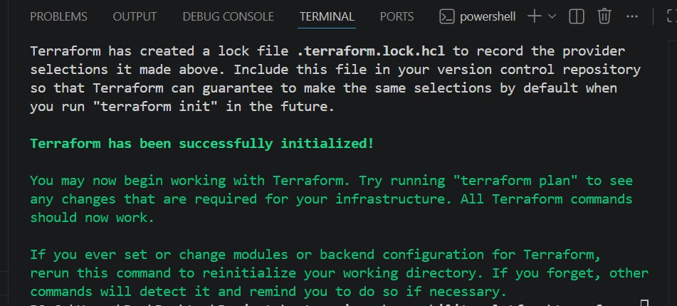

### EC2 Instance

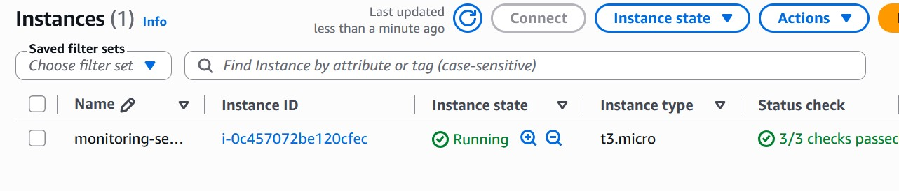

### Security Groups
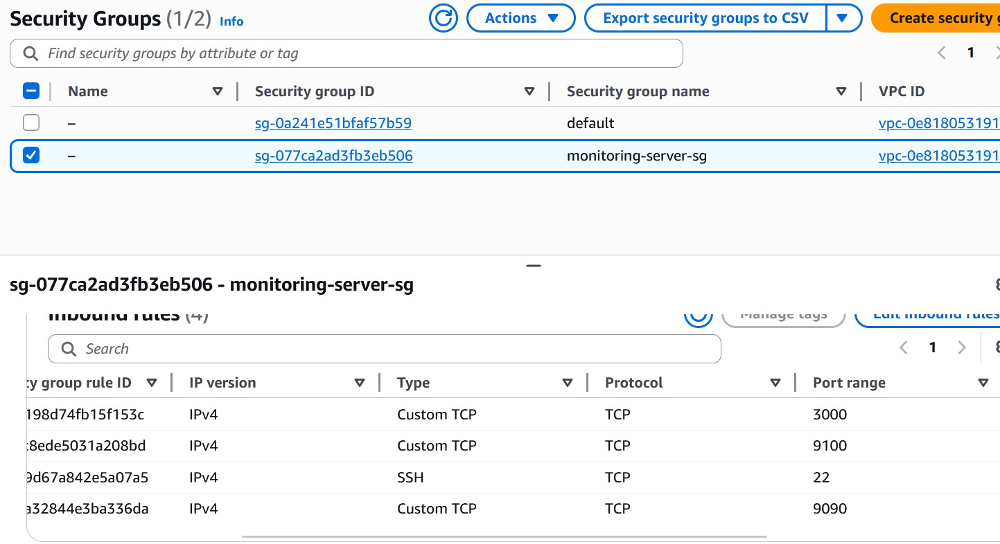

### Grafana

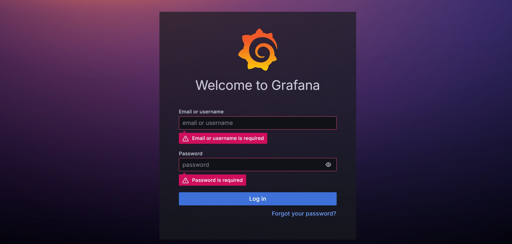

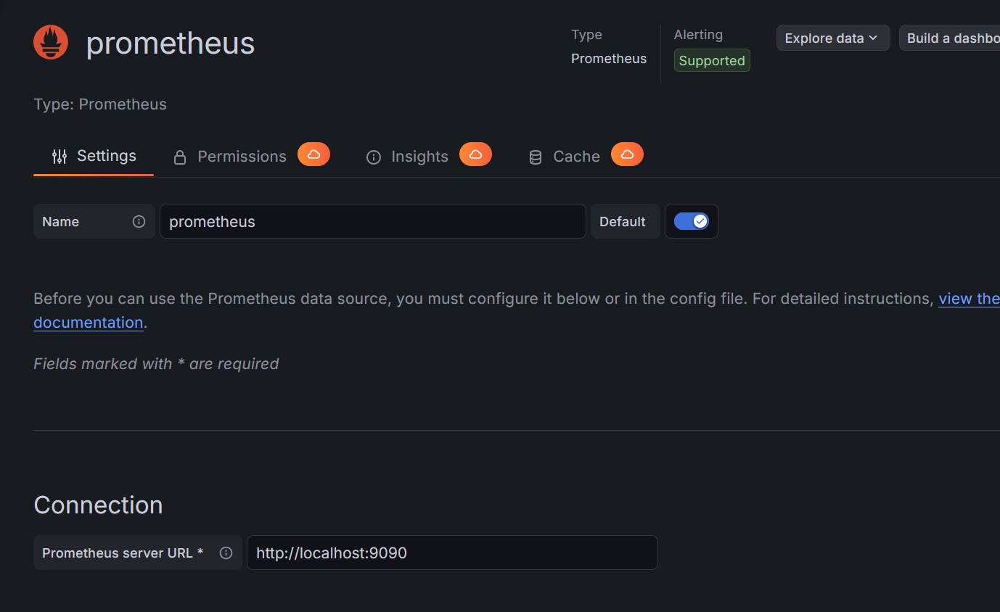

### Grafana Dashboard

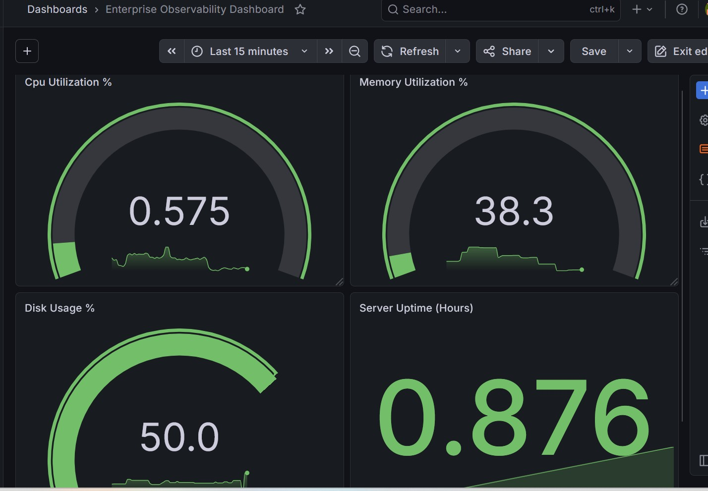

### Prometheus

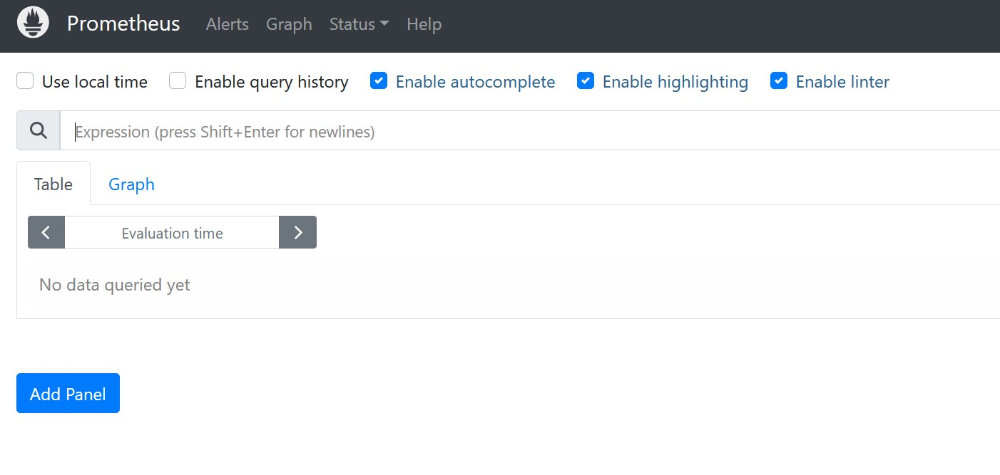

### CloudWatch Alarm

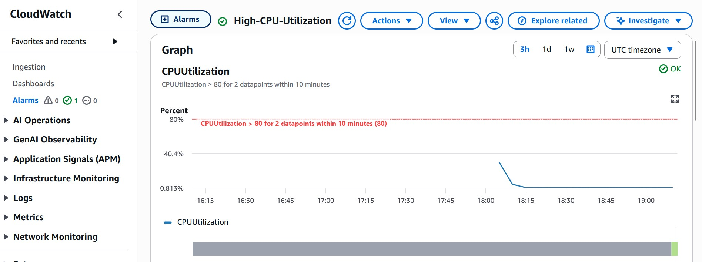

### SNS Notifications

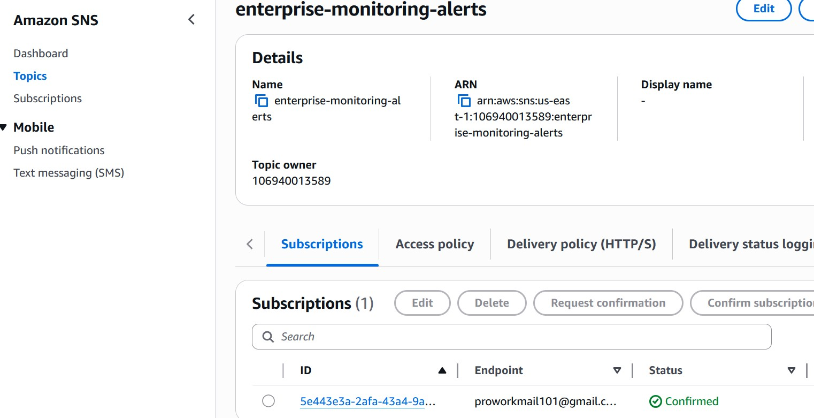

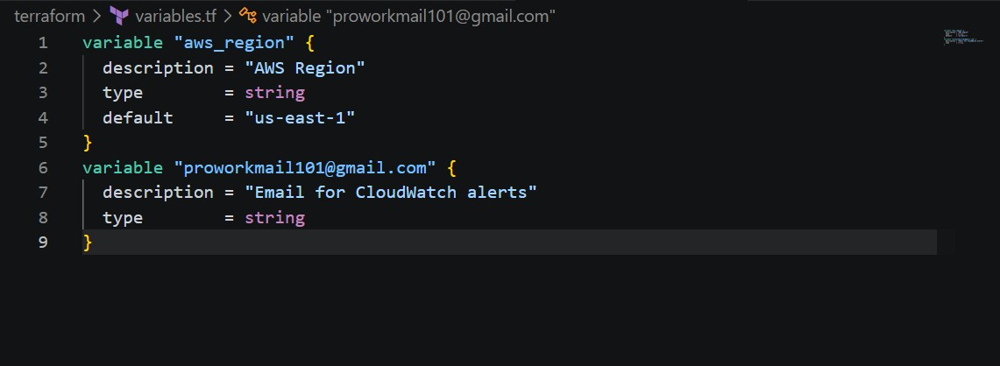

### Alert Emails

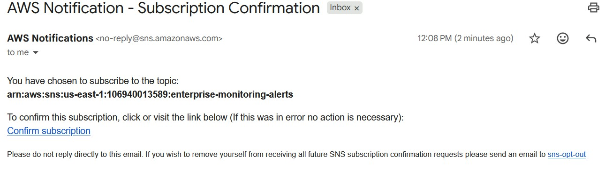

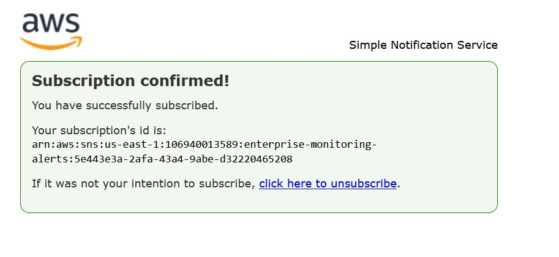
